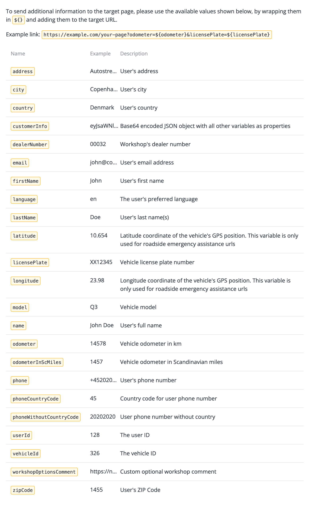

[Go back to Integrations](./integrations/intro)

# Autofill form for online service booking
By autofilling the form for online service booking, the customer can get through your existing online booking flow much faster with less risk of typos or other erroneous input.

This integration will take care of populating the form with the customer's information by injecting the data in the link, normally using query parameters.

_Flow diagram_

## Adding support for receiving the data in the booking links
Make sure your existing online service booking form accepts customer data included in the URL query parameters (query string/component). All of the query parameters should be considered optional and the customer should therefore be able to fill in the information like before if it can not be prefilled.

There is an example of some of the available variables below but to get the current list of available variables, you should follow the steps below to the page for editing booking links where you will find the full list. On that page you will also find buttons for testing the link with example data.

## Updating the booking links for each workshop
1. Log in to ConnectedWorkshop
2. Go to settings (by clicking on your initials in the lower left corner)
3. Go to the "Workshop" pane and select the workshop you wish to edit
4. Select the "Booking" tab and edit the booking links from there

The booking links can be populated with various variables (see screenshot below) like `https://example.com/your-page?odometer=${odometer}&licensePlate=${licensePlate}`.

_Screenshot of booking autofill variables_

## Demo

