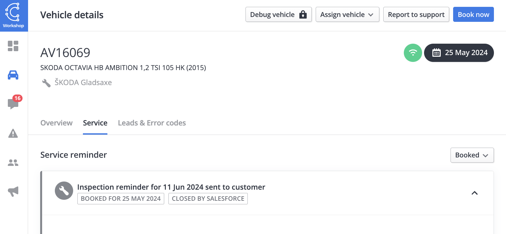

[Go back to Integrations](./integrations/intro)

# Import service bookings
Service bookings can be pushed to Connected Cars when they are added, changed or cancelled. The service bookings will help reduce friction as it allows Connected Cars to for instance automatically close service reminders if the customer already booked a timeslot for getting the service done.

The import of service bookings uses the standard GraphQL pull API via the `addBooking`, `changeBooking` and `cancelBooking` mutations. Descriptions of the fields and example requests can be found below. Further details on working with the pull API can be found on [the dedicated page](./integrations/pull-api).

_Screenshot of booking data show in ConnectedWorkshop/ConnectedLeasing_


## Field Descriptions
- Also documented by searching the `addBooking`, `changeBooking` and `cancelBooking` mutations in schema or https://api.connectedcars.io/graphql/graphiql/

| Key                        | Type                | Example                          | Notes                                                        |
|----------------------------|---------------------|----------------------------------|--------------------------------------------------------------|
| `bookingSource`            | Enum              | `user`                           | Source of the booking. As service account use your relevant source|
| `bookingId`                | String              | `abc-123`                        | Booking ID from the booking system                           |
| `bookingDealer`            | String              | `DEU12345N`                          | Dealer number, KVPS or similar for the booking               |
| `vin`                    | String              | `WVWZZZAUZKW123456`              | Vehicle identification number                                |
| `fleetId`                | ID               | 123                            | Fleet ID (optional)                                          |
| `reasonKey`              | String              | `service`                        | Reason key for booking (optional)                            |
| `reasonText`             | String              | `Service`                        | Reason text for booking (optional)                           |
| `workshopId`             | ID               | 789                            | Workshop ID (optional)                                       |
| `appointmentDate`        | Datetime (RFC3339)  | `2022-08-23T13:30:00.000Z`         | Timestamp of the booking in UTC                              |
| `bookingCreatedAt`            | Datetime (RFC3339)  | `2022-08-20T13:37:00.000Z`         | Timestamp of when the booking was created in UTC. If not provided defaults to now                     |


## Business logic:

- _Active booking_: An active booking is a booking that is not cancelled and not in the past.

## Add a booking
A booking can only be added if there is no active booking associated to the vehicle.
If you want to add a new booking to a vehicle that already has an active booking, the active booking needs to be canceled ( `CancelBooking` )

### Example request for adding a booking
```sh
curl 'https://api.connectedcars.io/graphql' \
  -X POST \
  -H 'Authorization: Bearer my-jwt' \
  -H 'Content-Type: application/json' \
  -H 'User-Agent: service-booking-integration/v1' \
  --data-raw '{"query":"mutation AddBooking(\n  $appointmentDate: String!\n  $bookingDealer: String!\n  $bookingId: String!\n  $bookingSource: String!\n  $vin: String!\n  $reasonKey: String!\n  $reasonText: String!\n) {\n  addBooking(\n    input: {\n      appointmentDate: $appointmentDate\n      bookingDealer: $bookingDealer\n      bookingId: $bookingId\n      bookingSource: $bookingSource\n      vin: $vin\n      reasonKey: $reasonKey\n      reasonText: $reasonText\n    }\n  )\n}\n","variables":{"appointmentDate":"2022-01-12","bookingDealer":"DEU12345N","bookingId":"12345","bookingSource":"user","vin":"WV1ZZZ1JZXW000001","reasonKey":"service","reasonText":"Service"},"operationName":"AddBooking"}'
```


## Change a booking
A booking can only be changed if there is already an active booking associated to the vehicle. A cancelled booking cannot be changed.

### Example request for changing a booking
```sh
curl 'https://api.connectedcars.io/graphql' \
  -X POST \
  -H 'Authorization: Bearer my-jwt' \
  -H 'Content-Type: application/json' \
  -H 'User-Agent: service-booking-integration/v1' \
  --data-raw '{"query":"mutation ChangeBooking(\n  $appointmentDate: String!\n  $bookingDealer: String!\n  $bookingId: String!\n  $bookingSource: String!\n  $vin: String!\n  $reasonKey: String!\n  $reasonText: String!\n) {\n  changeBooking(\n    input: {\n      appointmentDate: $appointmentDate\n      bookingDealer: $bookingDealer\n      bookingId: $bookingId\n      bookingSource: $bookingSource\n      vin: $vin\n      reasonKey: $reasonKey\n      reasonText: $reasonText\n    }\n  )\n}\n","variables":{"appointmentDate":"2022-01-12","bookingDealer":"DEU12345N","bookingId":"12345","bookingSource":"user","vin":"WV1ZZZ1JZXW000001","reasonKey":"maintenance","reasonText":"Maintenance Update"},"operationName":"ChangeBooking"}'
```

## Cancel a booking
A booking can only be cancelled if there is an active booking.

### Example request for cancelling bookings
```sh
curl 'https://api.connectedcars.io/graphql' \
  -X POST \
  -H 'Authorization: Bearer my-jwt' \
  -H 'Content-Type: application/json' \
  -H 'User-Agent: service-booking-integration/v1' \
  --data-raw '{"query":"mutation CancelBooking(\n  $bookingId: String!\n) {\n  cancelBooking(\n    input: {\n      bookingId: $bookingId\n    }\n  )\n}\n","variables":{"bookingId":"12345"},"operationName":"CancelBooking"}'
```
