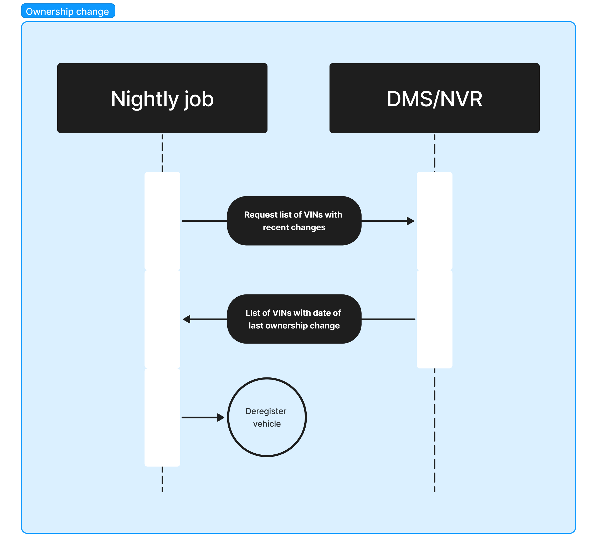

[Go back to Integrations](./integrations/intro)

# Deregistration on change of ownership
When a vehicle changes ownership, Connected Cars need to revoke access to the vehicle from the previous owner. To achieve this a list of ownership changes need to be made available. The ownership changes should be retrieved from the national vehicle registry. The date/time of when the change occurred will be compared to the activation date/time of the vehicle to help ensure that newly activated vehicles does not have their access erroneously revoked.

The endpoint should be available via HTTPS and can require authentication via a symmetric key (like an API key listed in the example below). The endpoint must accept from and to dates as input (query parameters). The endpoint must return a JSON response with a 200 status code. The response must contain a list of all ownership changes that occurred in the time range requested.

Once the endpoint is ready, provide Connected Cars with the details. Connected Cars will then implement the automatic removal of vehicle access based on the provided endpoint.

_Sequence diagram_


## Field descriptions
| Key            | Type                                         | Example                    | Notes    |
|:---------------|:---------------------------------------------|:---------------------------|:---------|
| `vin`          | String                                       | `WVWZZZAUZKW123456`        | Required |
| `changedAt`    | Datetime, RFC3339                            | `2022-08-23T13:37:00.000Z` | Required |
| `reason`       | Enum(`deregistration`, `new_owner`, `other`) | `deregistration`           | Optional, `deregistration` could be when a vehicle gets exported or scrapped while `new_owner` could be the vehicle getting sold to another person |
| `oldUser`      | String                                       | `old-email@example.com`    | Optional |
| `newUser`      | String                                       | `new-email@example.com`    | Optional |

## Example request and output
```
GET https://example.com/ownership-changes?from=2022-08-01&to=2022-08-31
X-Api-Key: some-api-key
```

```json
[
  {
    "vin": "WVWZZZAUZKW123456",
    "changedAt": "2022-08-23T13:37:00.000Z",
    "reason": "deregistration",
    "oldUser": "old-email@example.com"
  },
  {
    "vin": "WVWZZZAUZKW654321",
    "changedAt": "2022-08-25T12:00:00.000Z",
    "reason": "new_owner",
    "oldUser": "old-email@example.com",
    "newUser": "new-email@example.com"
  }
]
```
