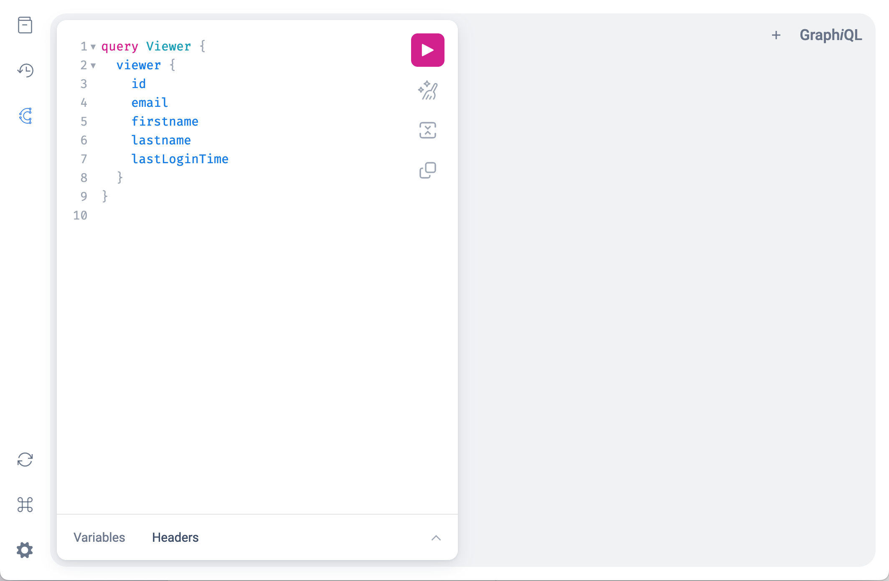

[Go back to Integrations](./integrations/intro)

# Generic integrations via pull API
The pull API is using [GraphQL](https://graphql.org/learn/). This API can be used for a wide range of integrations as this API is powering ConnectedWorkshop, ConnectedFleet and MyConnectedCar. The pull API relies on the [Auth API](./auth-api) for creating users and authenticating requests (via short-living JWT).

## Starting with the API explorer
1. Go to https://api.connectedcars.io/graphql/graphiql
2. To authenticate, click the Connected Cars login in the left menu and follow the instructions
3. Write your GraphQL in the left pane (documentation can be expanded via the left menu) and see the result in the right pane

_Screenshot of GraphiQL_


## Starting with example code
See our [samples](https://github.com/connectedcars/docs/tree/master/samples/) folder.

## Starting from zero
Use the Auth API for authenticating and run `POST https://api.connectedcars.io/graphql` requests with the JWT in the `Authorization` header.

Example in cURL (replace `my-jwt` and `my-custom-integration/v1`):
```sh
curl 'https://api.connectedcars.io/graphql' \
  -X POST
  -H 'Authorization: Bearer my-jwt'
  -H 'Content-Type: application/json'
  -H 'User-Agent: my-custom-integration/v1'
  --data-raw '{"query":"query Viewer { viewer { id, email, firstname, lastname, lastLoginTime } }","operationName":"Viewer"}'
```
