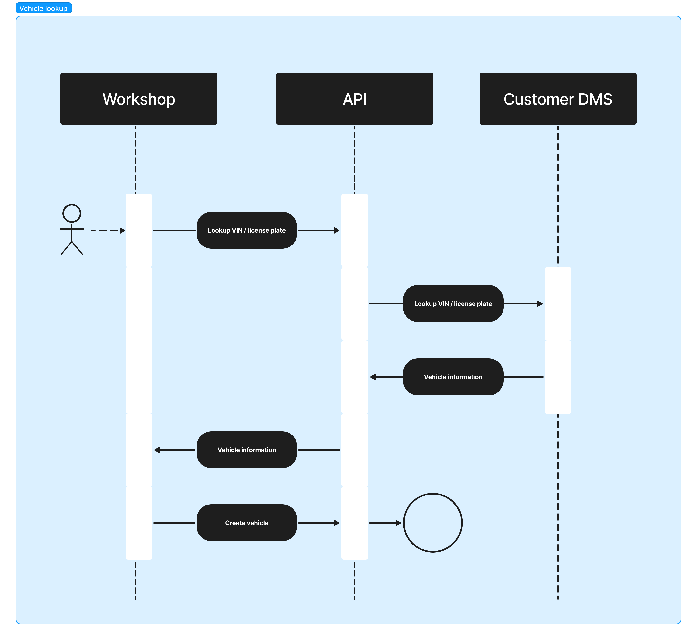

[Go back to Integrations](./integrations/intro)

# Prefill via vehicle lookup
When the users of ConnectedWorkshop creates a vehicle, they enter the VIN or license plate and the system then uses that to look up vehicle details from an endpoint you make available. The vehicle details needed are listed below and should be retrieved from either the manufacturer or the national vehicle registry.

The endpoint should be available via HTTPS and can require authentication via a symmetric key (like an API key listed in the example below). The endpoint must accept both VIN and license plate as input (query parameters) and one of them should be required. If a vehicle is found, the endpoint must return a JSON response with a 200 status code. If a vehicle is not found, the endpoint must return a 404 status code.

Once the endpoint is ready, provide Connected Cars with the details. Connected Cars will then implement the prefill based on the provided endpoint.

_Sequence diagram_


## Field descriptions
| Key                    | Type                                                                                         | Example                                | Notes                                                      |
|:-----------------------|:---------------------------------------------------------------------------------------------|:---------------------------------------|:-----------------------------------------------------------|
| `vin`                  | String                                                                                       | `WVWZZZAUZKW123456`                    | Required                                                   |
| `licensePlate`         | String                                                                                       | `AB12345`                              | Required                                                   |
| `description`          | String                                                                                       | `VW Golf GTE Hybrid 1,4TSI 204HK DSG6` | Required                                                   |
| `modelYear`            | Number                                                                                       | 2021                                   | Required                                                   |
| `engineCode`           | String                                                                                       | `CZDA`                                 | Required, three or four characters                         |
| `brand`                | String                                                                                       | `Volkswagen`                           | Optional, will be derived from VIN if not provided         |
| `model`                | String                                                                                       | `Golf`                                 | Optional, will be derived from description if not provided |
| `fuelType`             | Enum(`diesel`, `gasoline`, `electric`, `hybrid`, `hybrid_diesel`, `natural_gas`, `hydrogen`) | `gasoline`                             | Optional, will be derived from description if not provided |
| `fuelTankSizeInLiters` | Number                                                                                       | 60                                     | Optional                                                   |

## Example request and output
```
GET https://example.com/vehicle-lookup?licensePlate=AB12345
X-Api-Key: some-api-key
```

```json
{
  "vin": "WVWZZZAUZKW123456",
  "licensePlate": "AB12345",
  "description": "VW Golf GTE Hybrid 1,4TSI 204HK DSG6",
  "modelYear": 2021,
  "engineCode": "CZDA",
  "brand": "Volkswagen",
  "model": "Golf",
  "fuelType": "gasoline",
  "fuelTankSizeInLiters": 60
}
```
